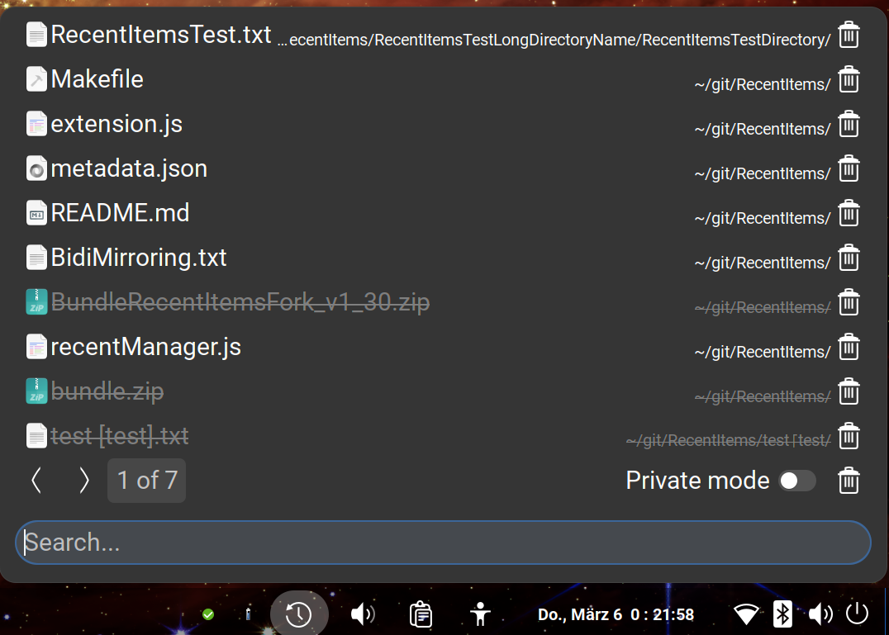

# RecentItems (Enhanced Fork)


## About This Fork

This fork enhances the original RecentItems GNOME extension with the following features and improvements:

### Completed TODOs from the Original Plugin:
- **Search Input Field:** Easily filter recent items using a search box at the top.
- **Simple Float-Right Icon:** A straightforward icon to the right of each item allows quick removal.

### New Features in This Fork:
- **GTK-independent RecentManager:** Enhanced version of BlankParticle's RecentManager.
- **Private Mode:** A mode to ensure that no new items are saved to the Recent Manager while active.
- **Blacklist Support:** Block specific MIME types and remove corresponding entries from `Gtk.RecentManager` automatically.
- **Installation via `make install`:** Simplifies installation by automating schema compilation and setup.
- **Bundle Creation via `make bundle`:** Generates a `bundle.zip` for easy distribution.
- **Translations for Multiple Languages:** 
  - Supported languages include:
    - `ar`, `ca`, `cs`, `de`, `el`, `es`, `eu`, `fa`, `fi`, `fr`, `hu`, `it`, `ja`, `nl`, `oc`, `pl`, `pt_BR`, `ru`, `sk`, `tr`, `uk`, `zh_CN`
- **Better Pagination:** Enhanced scrolling and navigation logic for smoother page transitions.
- **Visualize removed files:** Visualize removed files in the recent items list.


## Installation Instructions

### Using `BundleEnhancedRecentItems.zip` (Recommended)

1. **Install from BundleEnhancedRecentItems.zip:**
   ```bash
   # Download the `BundleEnhancedRecentItems.zip`
   wget https://github.com/lgoio/RecentItems/releases/download/v32/BundleEnhancedRecentItems_v32.zip
   # Extract the `BundleEnhancedRecentItems.zip` to ~/.local/share/gnome-shell/extensions/RecentItems@lgo.io
   unzip -o BundleEnhancedRecentItems_v32.zip -d ~/.local/share/gnome-shell/extensions/RecentItems@lgo.io
   # Compile schemas for the extension as following:
   glib-compile-schemas ~/.local/share/gnome-shell/extensions/RecentItems@lgo.io/schemas
   ```

2. **Restart GNOME Shell:**
   - Press `Alt + F2`, type `r`, and press Enter.
   - Alternatively, log out and log back in.
   - Alternatively, just reboot.

3. **Enable the Extension:**
   - Open GNOME Extensions and enable **Enhanced Recent Items**.

## Manual Installation (Alternative)

If you prefer to install from the source code, follow these steps:

1. Clone or download the repository:
   ```bash
   git clone https://github.com/lgoio/RecentItems.git
   cd RecentItems
   make install

## Important: This extension is not on extensions.gnome.org for now

### Why?

This extension is a fork of bananenfisch's RecentItems and was originally intended for integration into the original project.
However, due to time constraints, the maintainer was unable to thoroughly review the changes,
which is why he ultimately rejected them.
Therefore, at his request, this extension remains a hard fork.
And because this extension is still fairly new, I want to fix all bugs before releasing it on extensions.gnome.org.

## Recent Items - an extension for gnome-shell

- left click to open file/folder
- right click to open containing folder

<https://extensions.gnome.org/extension/72/recent-items/>

## TODOS:

- shortcut, like \<super\>+r
- option to pin files on top?
